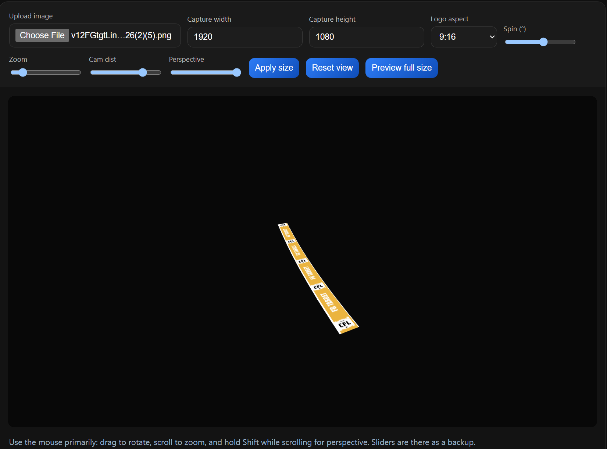
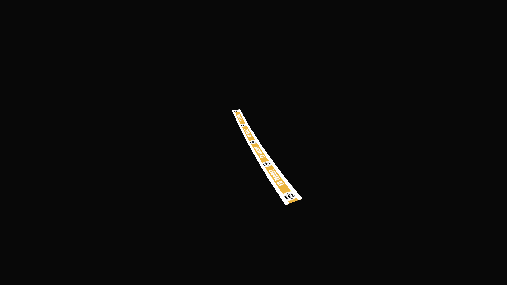

# WebGL Image Viewer

**Live demo:** https://gagikh.github.io/webgl/

A single-file WebGL viewer for inspecting images (logos, graphics) with 3D perspective controls. Useful for previewing how a logo will look when projected onto a broadcast surface (e.g. a football field) at an angle.



## Workflow

1. **Upload** your logo or image.
2. **Adjust the view** — use Spin, tilt, rotate, zoom, camera distance, perspective, and logo aspect ratio until the scene matches how the logo will appear in the real broadcast.
3. When the view looks right, **right-click the canvas → Save image**, then open the saved file to see exactly how it will look at full resolution.
4. Alternatively, click **Preview full size** to open the full-resolution render (default 1920×1080) directly in a new tab without saving.



Iterate as needed: tweak settings → save or preview → check → tweak again.

## Run locally

```bash
python -m http.server 8000
```

Then open `http://127.0.0.1:8000/`

## Controls

### Mouse
| Action | Effect |
|--------|--------|
| Drag up/down | Tilt the image forward/backward (X rotation) |
| Drag left/right | Rotate the image left/right (Y rotation) |
| Scroll | Zoom in/out |
| Shift + Scroll | Adjust perspective |

### UI controls
| Control | Description |
|---------|-------------|
| **Upload image** | Load a local image file |
| **Capture width / height** | Internal canvas resolution (default 1920×1080) |
| **Logo aspect** | Override the logo's display aspect ratio in the scene; "Native" uses the image's real pixel ratio |
| **Spin (°)** | Rotate the logo in-plane around its center (−180° to +180°) |
| **Zoom** | Scale the image (0.2–20) |
| **Cam dist** | Camera distance — higher = weaker foreshortening (0.3–10) |
| **Perspective** | Foreshortening strength — higher = more dramatic depth effect (0.1–2.0) |
| **Apply size** | Apply the capture width/height to the canvas |
| **Reset view** | Restore default zoom, camera, perspective, and rotation |
| **Preview full size** | Open the current render at full canvas resolution in a new tab |

## Getting the broadcast field look

1. Load a bird's-eye or flat image of the field/surface.
2. Drag **downward** to tilt the image (bottom becomes near, top becomes far).
3. Increase the **Perspective** slider to strengthen the foreshortening.
4. Adjust **Cam dist** to control how dramatically depth falls off with distance.
5. Click **Preview full size** to check how the logo reads at 1920×1080.

## Logo quality guidelines

### 1. Check the logo size

Always check the pixel dimensions of your logo before using it (example: 160 × 2667).

### 2. Avoid very large or very tall logos

Some logos are too tall and must be heavily scaled down when shown on a Full HD screen (1920 × 1080).

**Example:** a logo that is 160 × 2667 px

If this logo is shown at about half the screen height, OpenGL must shrink it from 2667 px down to around 540 px.

This causes:
- Loss of detail
- Blurry text
- Visible edge artifacts

### 3. Recommended logo sizes

Try to design logos closer to the final display size. If the logo will appear at ~half screen height, use something like:

- 120 × 600
- 200 × 700
- 300 × 800

**Recommended height range: 500–800 px**

### 4. Text inside logos

When a logo contains text:
- Keep spacing between letters
- Avoid very thick or heavy lettering
- Avoid tightly packed text

Simple and well-spaced text stays readable after scaling.

### 5. Optional improvement

A small blur (around 2–3 px) applied to the logo *before* rendering can help reduce harsh edges after scaling, especially when letters are close together.

### 6. IMPORTANT: Always check how it looks in the real scene

Do not rely only on file size or a zoomed-in view. Use this tool to place the logo at the actual perspective and scale it will have in the broadcast, then use **Preview full size** to verify quality at 1920 × 1080.
